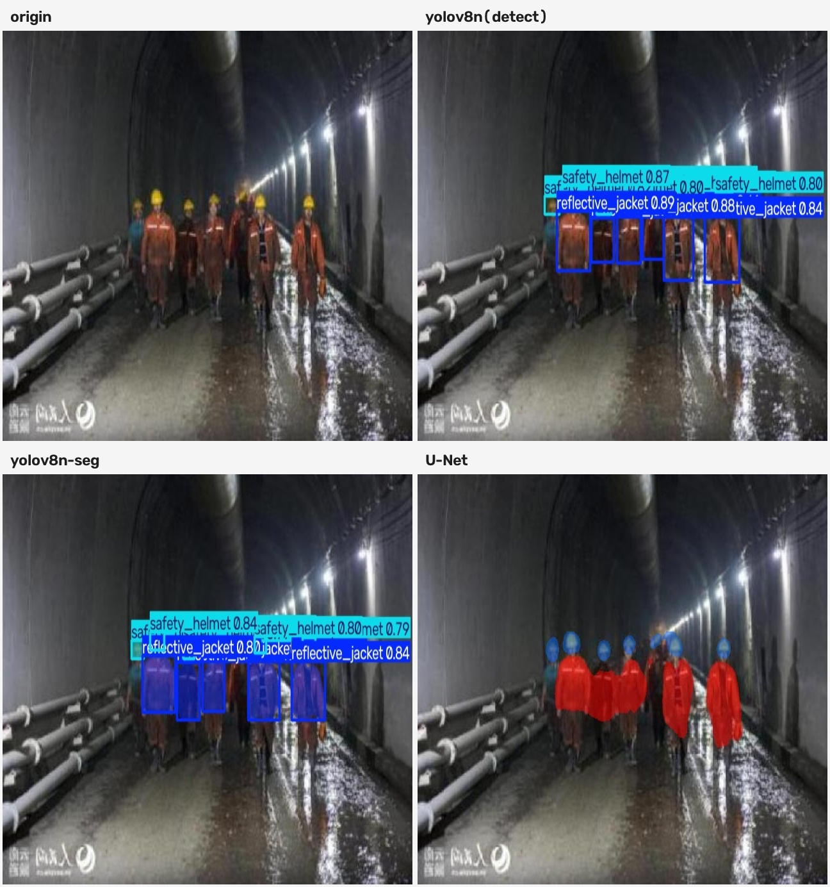
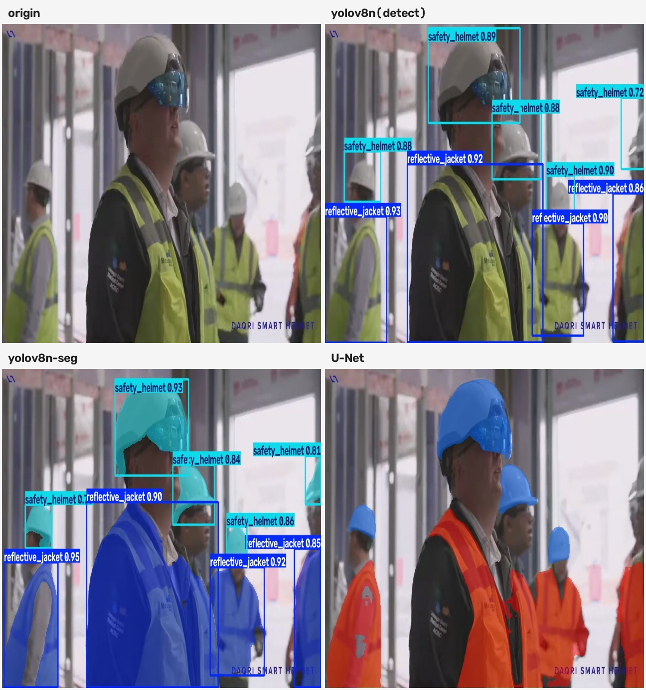
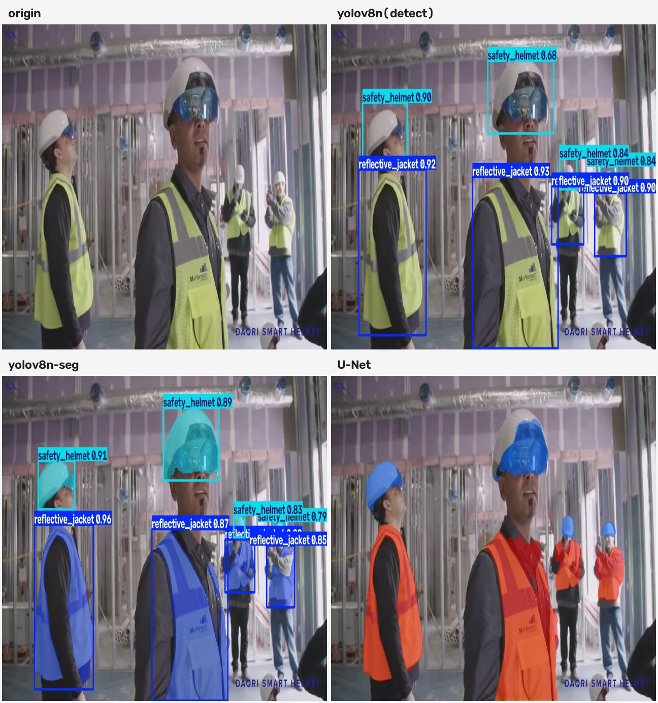
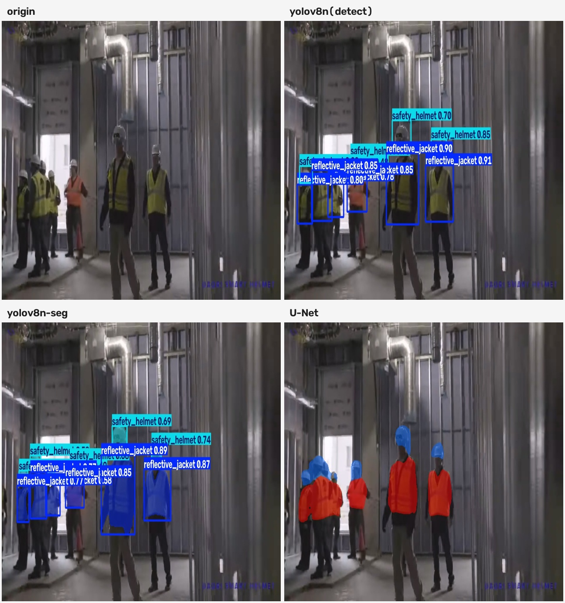

# 2조 미니 프로젝트 — 안전장구(Vest & Helmet) 탐지

라벨 방식과 모델 구조가 성능에 어떤 차이를 만드는지 비교한다.
라벨을 만드는 도구와, 그 라벨로 모델을 학습·비교하는 코드를 폴더로 나눠 둔다.

| 폴더 | 담당 | 하는 일 |
|------|------|---------|
| [`labeling_studio/`](labeling_studio/) | [@Basearchio](https://github.com/Basearchio) | 원본 이미지에서 segmentation 라벨을 만들고 검수하는 도구 |
| [`model_compare/`](model_compare/) | [@yunilkim](https://github.com/yunilkim) | 만들어진 데이터셋으로 세 모델을 학습·평가·비교 |

두 폴더는 독립적으로 돈다. 각자 `README.md`, `requirements.txt`, `.gitignore` 를 갖고 있으니
쓰려는 쪽 폴더로 들어가서 그 안의 README 를 보면 된다.

```bash
cd labeling_studio    # 라벨을 만들 때
cd model_compare      # 모델을 학습·비교할 때
```


## 목표

같은 이미지에 bbox 라벨만 존재하는 데이터셋을 폴리곤과 클래스 지도로 변환하여  라벨 방식과 모델 구조가 성능에 어떤 차이를 만드는지를 보고 유사 데이터셋과의 성능차이를 비교해본다.

| 모델 | 라벨 | 종류 | 대표 지표 (test) |
|------|------|------|------|
| `yolov8n` | 바운딩 박스 | detection | mAP50 0.9516 |
| `yolov8n-seg` | 폴리곤 | instance segmentation | mAP50 0.9457 / pixel_mIoU 0.7912 |
| `U-Net` (ResNet34 인코더) | 폴리곤 → 클래스 지도 | semantic segmentation | pixel_mIoU 0.7785 |

두 쌍으로 나눠서 본다. 한 번에 하나만 다르게 해야 원인을 짚을 수 있다.

| 비교 쌍 | 다른 점 | 알 수 있는 것 | 쓰는 지표 |
|---------|---------|---------------|-----------|
| yolov8n ↔ yolov8n-seg | 라벨만 | 라벨 방식의 효과 | mAP, box_mIoU |
| yolov8n-seg ↔ U-Net | 모델 구조만 | 인스턴스 vs 시맨틱 | pixel_mIoU, pixel_Dice |

U-Net 은 박스를 내지 않아서 mAP 를 쓸 수 없다. yolov8n-seg 가 양쪽 지표를 다 낼 수 있어서
두 비교를 이어주는 기준이 된다.

Mask R-CNN 도 만들어 뒀지만(`models/mask_rcnn.py`) 쓰지 않는다.
yolov8n-seg 와 같은 인스턴스 분할이라 대비가 약해서 시맨틱 분할인 U-Net 으로 바꿨다.

---

## 결과 미리보기



수치 비교는 [`model_compare/README.md`](model_compare/README.md#결과) 를 본다.

### 외부 데이터 예측

학습에 쓰지 않은 영상에서 뽑은 프레임에 세 모델을 그대로 적용한 결과다.
배경도 조명도 장비 색도 데이터셋과 다른데 세 모델 모두 찾아낸다.
(영상 출처 : [Youtube](https://www.youtube.com/watch?v=i4492vQqMrU))

<p align="center">
  
  
  
</p>

`model_compare/step7_external.py` 로 만든다.

## 데이터셋

[vest-helmet (Roboflow Universe)](https://universe.roboflow.com/uhhh/vest-helmet-wlbch) 를 쓴다.
원본 이미지는 640×640, 클래스는 `reflective_jacket` 과 `safety_helmet` 둘이다.

원본을 손봐서 세 벌을 둔다.

| 데이터셋 | train | valid | test | 합계 | 라벨 |
|----------|-------|-------|------|------|------|
| `vest-helmet.v1i_roboflow_origin` | 6,681 | 1,427 | 1,418 | 9,526 | 원본 (비교용 보관) |
| `vest-helmet_crop_dedup` | 6,681 | 1,258 | 1,230 | 9,169 | 박스 (detection) |
| `vest-helmet_crop_dedup_seg` | 6,681 | 1,258 | 1,229 | 9,168 | 폴리곤 (segmentation) |

- **crop** — 이미지에 붙어 있던 반사 패딩을 잘라냈다. 그래서 640×640 이 아닌 이미지가 섞인다.
- **dedup** — split 사이에 겹치는 이미지를 뺐다. valid·test 가 원본보다 줄어든 이유다.

segmentation 쪽 test 가 1장 적다. 비교는 양쪽에 다 있는 이미지로만 하므로 결과에는 영향이 없다.

객체 수는 `vest-helmet_crop_dedup_seg` 기준이다.

| split | reflective_jacket | safety_helmet | 합계 |
|-------|-------------------|---------------|------|
| train | 10,419 | 12,661 | 23,080 |
| valid | 1,885 | 2,355 | 4,240 |
| test | 1,886 | 2,405 | 4,291 |

헬멧이 조끼보다 개수는 많지만 하나하나가 작아서, 픽셀로 세면 전체의 3% 밖에 되지 않는다.

`labeling_studio/db`, `labeling_studio/work`, `model_compare/Data` 는 용량이 커서 git 에 없다.
각자 로컬에 두고 쓴다.
